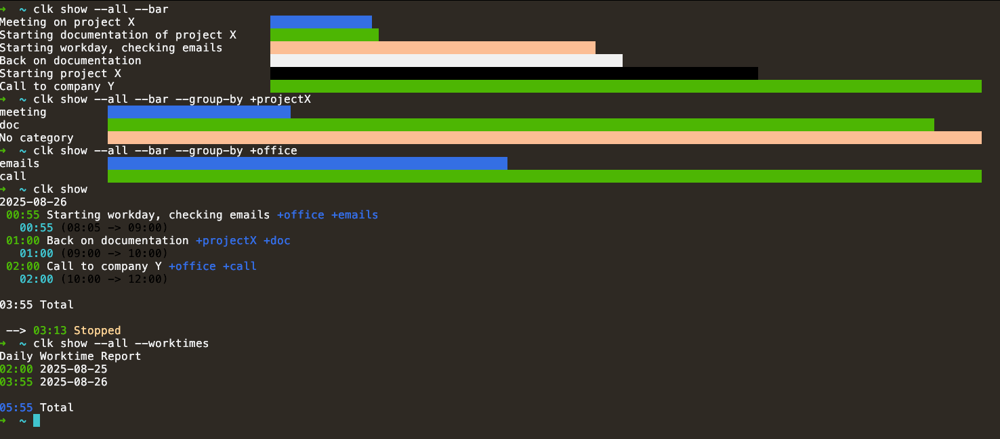
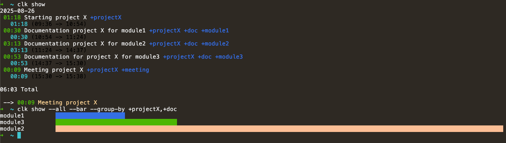

# Command-line time tracker written in dotnet core

This is a small command-line utility to track your time using the command line.

## How to install

Download the executable from the build artifacts. Then, alias the executable `clk` with your favorite shell.

### Mac OS

On macos, if you use zsh, you can add the following line to your [profile](https://www.gnu.org/software/bash/manual/html_node/Bash-Startup-Files.html), _i.e._ `~/.zshenv` file (if you downloaded the package into the downloads folder):

```zsh
alias clk="~/Downloads/clk/clk"
```

Remark: on macos, it is possible that the OS prevents you from running the software. Update the security settings to allow the `clk` program to run.

### Windows PowerShell

On windows, you can install this tool in `$env:UserProfile/.clk/bin` using the following script:

```pwsh
. { iwr -useb "https://raw.githubusercontent.com/computoms/clk/refs/heads/main/install/install.ps1" } | iex;
```

On windows, if you use Powershell, you can add the following line to your [profile](https://learn.microsoft.com/en-us/powershell/module/microsoft.powershell.core/about/about_profiles?view=powershell-7.2):

```pwsh
New-Alias -Name clk -Value "$env:UserProfile/.clk/bin/clk"
```

This is automatically added to your `$profile` by the `install.ps1` script.

# Usage

This simple utility uses a text file to store tasks with date/time information. Each time you start working on a task, a new line is created on the file with the current time and a description of the task you are starting to work on.

At the end of the day, or anytime, you can then generate reports and statistics based on the file.

## File structure

The file structure is very simple and can be edited using the script or directly with your favorite text editor.
Here is an example file:

```
[2022-01-01]
10:00 Starting project X +projectX
11:23 Starting documentation of project X +projectX +doc
12:00 [Stop]
[2022-01-02]
08:05 Starting workday, checking emails +office +emails
09:00 Back on documentation +projectX +doc
10:00 [Stop]
```

## Tags and ids

An entry in this file can be associated with tags if you start the tag with a `+` (`+tag`) or ID if you start with a `.` (`.456`). 

Tags allow for powerful filtering and reporting.

IDs allow to track time of tasks from an external tool, such as Jira. They also allow to restart a task if you know its id (see examples below).

## Special tasks

The `[Stop]` task is used to stop the last task. It is not required if you switch tasks without taking a break.

## Settings

Some settings can be configured, in `~/.clk/settings.yml`:

```yml
File: /Users/thomas/clock.txt # Path to the file we use to store our tasks 
DefaultTask: Admin +internal # Default task using when using command add without any other parameters
EditorCommand: code # Command used to open the clock.txt with `clk open`
```

Additionally, a custom settings file can be passed using the `--settings /path/to/file.yml` flag.

## Adding new entries

You can add a new entry by using the `add` command:

```
$ clk add Definition of the prototype +myapp +proto
```

To switch to a new task, just use the same command:

```
$ clk add Switching to new task
```

This will automatically stop the last task and start a new one. When you have finished working, use the `stop` command:

```
$ clk stop
```

If you forgot to add a task, you can add it later using the `--at` option:

```
$ clk add --at 10:00 Forgot to add a task
```

### Restarting last entry

After you took a break by using the `clk stop` command, you can restart the latest task using the `restart` command.

### Restarting a task by id

You can also only specify the id of a task that has already been tracked before, and this will add the corresponding title/tags automatically:

```
$ clk add This is a new task with an id +tag .123
$ clk stop
$ clk add This is a second task
$ clk add .123 # Will automatically add the entry 'This is a new task with an id +tag .123'
```

## Reports

You can show reports/statistics with the `show` command:

```
$ clk show
```

#### Details

By default, the details of today are shown.

To show the details for yesterday, use the `--yesterday` (or `-y`) switch. 

To show the details of all tasks in the file, use the `--all` (or `-a`) switch.

#### Time worked

You can also show the time worked per day for the entire week using the `--week` option (or `-w`) or the time worked per week for the entire period using the `--all` in combination with the `--worktimes` switches (equivalent to `-aw`).

## Opening file

The command `open` allows to open the `clock.txt` source file with the default editor (configured in settings as `EditorCommand`, default is `code`).

## Listing tasks

All task names (with tags and ids) can be found using the `list` command. This is useful to be used with [fzf](https://github.com/junegunn/fzf/blob/master/README.md):

```bash
TASK_NAME=$(clk list | fzf); clk add $TASK_NAME
```

The above line allows to find an existing task by fuzzy finding its name, then adding it as current task.

## Arguments and options

Here is a list of arguments and a short description to each one:

Filters:

- `--all` / `-a` : select all tasks without filtering
- `--week` / `-t` : selects tasks from the current week
- `--yesterday` / `-y` : selects tasks from yesterday
- `--group-by` : used for filtering based on tags. Values can be `tags` to filter on the first tags of the tasks or `+tag` to filter tasks based on tag `tag` and display the bars according to the second level tag, or `+tag1,+tag2` to filter tasks based on multiple tags (and display bars according to the nth level tag).

Reports:

- `--worktimes` / `-w` : shows time worked for each day of the week or each week of the month
- `--bar` / `-b` : display bar graphs
- `--details` / `-d` (default) : displays the details of each task

Other options:

- `--at xx:xx` : add task at a specific time
- `--settings /path/to/file` : specify a non-default settings file

**Note**: single character options can be combined, _e.g._ `-ad` shows all tasks using the details report.

## Examples



Filtering by multiple tags:

