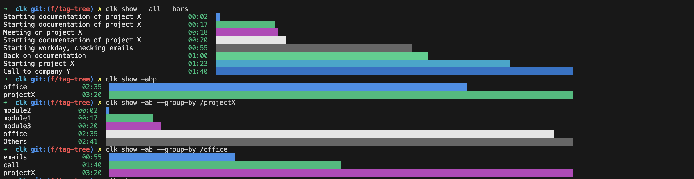

# Command-line time tracker written in dotnet core

This is a small command-line utility to track your time using the command line.

## How to install

Download the executable from the build artifacts. Then, alias the executable `clk` with your favorite shell.

### Mac OS

You can install clk into `~/.clk/bin` using the following command:

```sh
curl https://raw.githubusercontent.com/computoms/clk/refs/heads/main/install/install.sh | sh
```

You need to have the `~/.clk/bin` in your PATH to use clk from your shell. If you use zsh, you can add the following line to your [profile](https://www.gnu.org/software/bash/manual/html_node/Bash-Startup-Files.html), _i.e._ `~/.zshenv` file:

```zsh
export PATH="~/.clk/bin:$PATH"
```

Remark: on macos, it is possible that the OS prevents you from running the software. Update the security settings to allow the `clk` program to run.

### Windows PowerShell

On windows, you can install this tool in `$env:UserProfile/.clk/bin` using the following script:

```pwsh
. { iwr -useb "https://raw.githubusercontent.com/computoms/clk/refs/heads/main/install/install.ps1" } | iex;
```

This script will also add the `$env:UserProfile/.clk/bin` to your PATH in the PowerShell `$PROFILE`.

# Usage

This simple utility uses a text file to store tasks with date/time information. Each time you start working on a task, a new line is created on the file with the current time and a description of the task you are starting to work on.

At the end of the day, or anytime, you can then generate reports and statistics based on the file.

## File structure

The file structure is very simple and can be edited using the script or directly with your favorite text editor.
Here is an example file:

```
[2022-01-01]
10:00 Starting project X /projectX
11:23 Starting documentation of project X /projectX/module1 +doc
12:00 [Stop]
[2022-01-02]
08:05 Starting workday, checking emails /office/emails
09:00 Back on documentation /projectX/module1 +doc
10:00 Start implementation of module 2 /projectX/module2 .002
11:00 [Stop]
```

### Tasks

An line in the file is either associated to a date tag (following lines represent tasks started that day) or a task.

A task is composed of:

- A _start time_, in the form `HH:mm`
- A _title_ composed of words separated by spaces
- An optional _path_, representing a hierarchical tree-like way of ordering and representing the task. A path is a single word starting with the `/` character, with sub-groups in the tree structure are separated by `/`, _e.g._ `/project/task/subtask`.
- Optional _tags_, allowsing to filter the tasks. A tag is a single word starting with `+`, _e.g._ `+meeting`
- An optional _id_, allowing to restart tasks and identify single tasks (or link tasks to external tools, such as Jira). An id is a single word starting with `.`, _e.g._ `.123`

A task does not have a stop time, as it's either:

- The start time of the following task
- The time specified by the special `[Stop]` task (see below)

### Special tasks

The `[Stop]` task is used to stop the last task. It is not required if you switch tasks without taking a break.

## Settings

Some settings can be configured, in `~/.clk/settings.yml`:

```yml
File: /Users/thomas/clock.txt # Path to the file we use to store our tasks 
DefaultTask: Admin +internal # Default task using when using command add without any other parameters
EditorCommand: code # Command used to open the clock.txt with `clk open`
```

Additionally, a custom settings file can be passed using the `--settings /path/to/file.yml` flag.

**Note**: on Windows, `EditorCommand` should reference the executable, such as `C:/Program Files/Microsoft VS Code/Code.exe`.

## Adding new entries

You can add a new entry by using the `add` command:

```
$ clk add Definition of the prototype /myapp/proto
```

To switch to a new task, just use the same command:

```
$ clk add Switching to new task
```

This will automatically stop the last task and start a new one. When you have finished working, use the `stop` command:

```
$ clk stop
```

If you forgot to add a task, you can add it later using the `--at` option:

```
$ clk add --at 10:00 Forgot to add a task
```

### Restarting last entry

After you took a break by using the `clk stop` command, you can restart the latest task using the `restart` command.

### Restarting a task by id

You can also only specify the id of a task that has already been tracked before, and this will add the corresponding title/tags automatically:

```
$ clk add This is a new task with an id +tag .123
$ clk stop
$ clk add This is a second task
$ clk add .123 # Will automatically add the entry 'This is a new task with an id +tag .123'
```

## Reports

You can show reports/statistics with the `show` command:

```
$ clk show
```

### Filters

Tasks can be filtered using the following options:

- `--all`                   : select all tasks
- `--week`                  : select tasks from current week
- `--yesterday`             : select tasks from yesterday
- `--tags <tag-filter>`     : select tasks based on a list of tags. `<tag-filter>` is a comma-separated list of tags to filter on (do not include `+` signs in this list).
- `--path <path-filter>`    : select tasks based on a path filter. `<path-filter>` is a path (starting with `/`) that will match all tasks with their paths starting by `<path-filter>`. All tasks with a path not starting by `<path-filter>` will be filtered out. Example: task `Task 1 /proj/task1` will be included in filter `<path-filter>`=`/proj` as well as `<path-filter>`=`/proj/task1`.

**Note**: if `--all`, `--week` or `--yesterday` is not specified, the default date filter is tasks from today.

### Report types

#### Details

Option: `--report details` (default)

By default, the details of today are shown.

To show the details for yesterday, use the `--yesterday` (or `-y`) switch. 

To show the details of all tasks in the file, use the `--all` (or `-a`) switch.

#### Timesheet

Option: `--report timesheet` or `--timesheet` or `-t`

You can also show the time worked per day for the entire week using the `--week` option (or `-w`) or the time worked per week for the entire period using the `--all` in combination with the `--worktimes` switches (equivalent to `-aw`).

#### Bar graphs

Option: `--report bars` or `--bars` or `-b`

Shows task durations and bars representing their percentage of the total duration of the selected tasks.

#### Grouping

Tasks can be groupped by task title (default) or using a path:

`--group-by <path-spec>`        : groups tasks by `<path-spec>`. `<path-spec>` is either `/*` to group by first level paths (_e.g_ a task with path `/project/task1` will be listed as `project`) or path specification, such as `/project` to list all sub-paths or `/project` (`task1` in last example).

This grouping option can be used with the bar graphs report as well as the details report.

Option `--group-by /*` can be simplified by `--group-by-path` or `-p`.

## Other commands

### Opening file

The command `open` allows to open the `clock.txt` source file with the default editor (configured in settings as `EditorCommand`, default is `code`).

### Listing tasks

All task names (with tags and ids) can be found using the `list` command. This is useful to be used with [fzf](https://github.com/junegunn/fzf/blob/master/README.md):

```bash
TASK_NAME=$(clk list | fzf); clk add $TASK_NAME
```

The above line allows to find an existing task by fuzzy finding its name, then adding it as current task.

### Getting current task

The command `current` allows to get the currently running task. If no task is running, `None` is returned.

This can be useful for automation / scripting.

## Arguments and options

Here is a list of arguments and a short description to each one:

Filters:

- `--all` / `-a` : select all tasks without filtering
- `--week` / `-t` : selects tasks from the current week
- `--yesterday` / `-y` : selects tasks from yesterday
- `--group-by` : used for filtering based on paths. Values can be `/*` to filter on the first path name of the tasks or `/<path1>[/<path2>...]` to filter tasks based on given path filter and display the bars according to the nth level path.
- `--group-by-path` / `-p` : short for `--group-by /*`.

Reports:

- `--report <report-name>`  : Show report `<report-name>`
- `--bars` / `-b`           : Show bar graphs report (short for `--report bars`)
- `--timesheet` / `-t`      : Show timesheet report (short for `--report timesheet`)

Filters:

- `--tags <tag-filter>`     : Filter by tags
- `--path <path-filter>`    : Filter by path

Other options:

- `--at xx:xx` : add task at a specific time
- `--settings /path/to/file` : specify a non-default settings file

**Note**: single character options can be combined, _e.g._ `-ab` shows all tasks using the bars report.

## Examples




